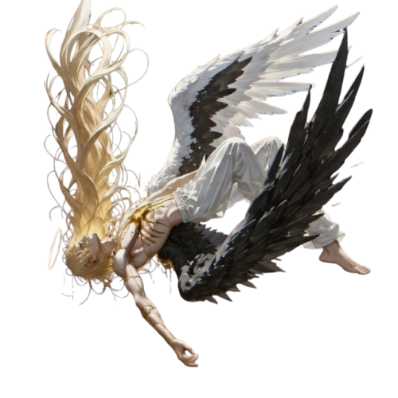

 
 

*Building at the intersection of Artificial Intelligence and human experience.*

◈ **Architecting Nyra** : A simulated human being with evolving emotional intelligence  
◈ **AI Research** : Deep-diving into LLMs, autonomous agents, and emergent behaviors  
◈ **Full-Spectrum Design** : From high-impact Chrome extensions to scalable ecosystems  
◈ **Core Philosophy** : Iterate with speed, think with depth, and bypass limits  
◈ **Strategic Partner** : Open to high-impact collaborations and moonshot ideas

  

<h2 align="center">◈ Armory ◈</h2>

  <h4>Core Arsenal</h4>
  
    
  <h4>Foundation & Fortress</h4>
  

  

<h2 align="center">◈ Creations ◈</h2>

| Project | Description | Tech |
|:---|:---|:---|
| **Nyra** | Simulated human AI with emotional intelligence, evolving memory, and sincerity detection | `Python` `FastAPI` `LLMs` |
| **MindGPT** | Human cloning via unique algorithms that evolve by following a subject throughout life | `Python` `PyTorch` `AI` |
| **LegalMe** | AI-powered legal assistant tailored for the needs of international students | `Python` `FastAPI` `LLMs` |
| **BBRewrite** | AI rewriting agent with context-aware precision and high fidelity output | `Python` `OpenAI` `NLP` |
| **RagSafe** | RAG prevention community platform for students in Bangladesh | `Next.js` `Supabase` |
| **Framic** | Premium media and cloud management application with high-performance storage | `Flutter` `Supabase` |

  <i>Note: Most projects listed are personal and reside in private repositories.</i>

  

<h3 align="center">◈ Battle Record ◈</h3>

  

<h2 align="center">◈ Contribution Snake ◈</h2>

<picture>
  <source media="(prefers-color-scheme: dark)"  srcset="https://raw.githubusercontent.com/shaonsikder1952/shaonsikder1952/output/github-contribution-grid-snake-dark.svg"/>
  <source media="(prefers-color-scheme: light)" srcset="https://raw.githubusercontent.com/shaonsikder1952/shaonsikder1952/output/github-contribution-grid-snake.svg"/>
  
</picture>

 

---

 

*"We are merely sophisticated meat dreaming of divinity, screaming at a God who never existed and wings we’ve replaced with machines. The stars don't witness heroes or villains; they only track brief flickers of heat on a cold rock, indifferent to the agony of a species that mistakes its own obsolescence for a legacy."*

 

